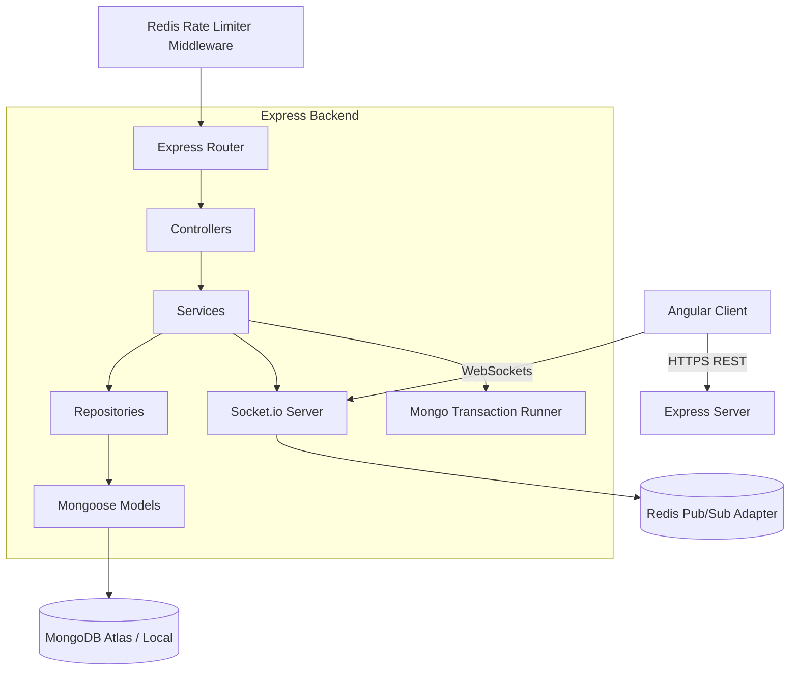
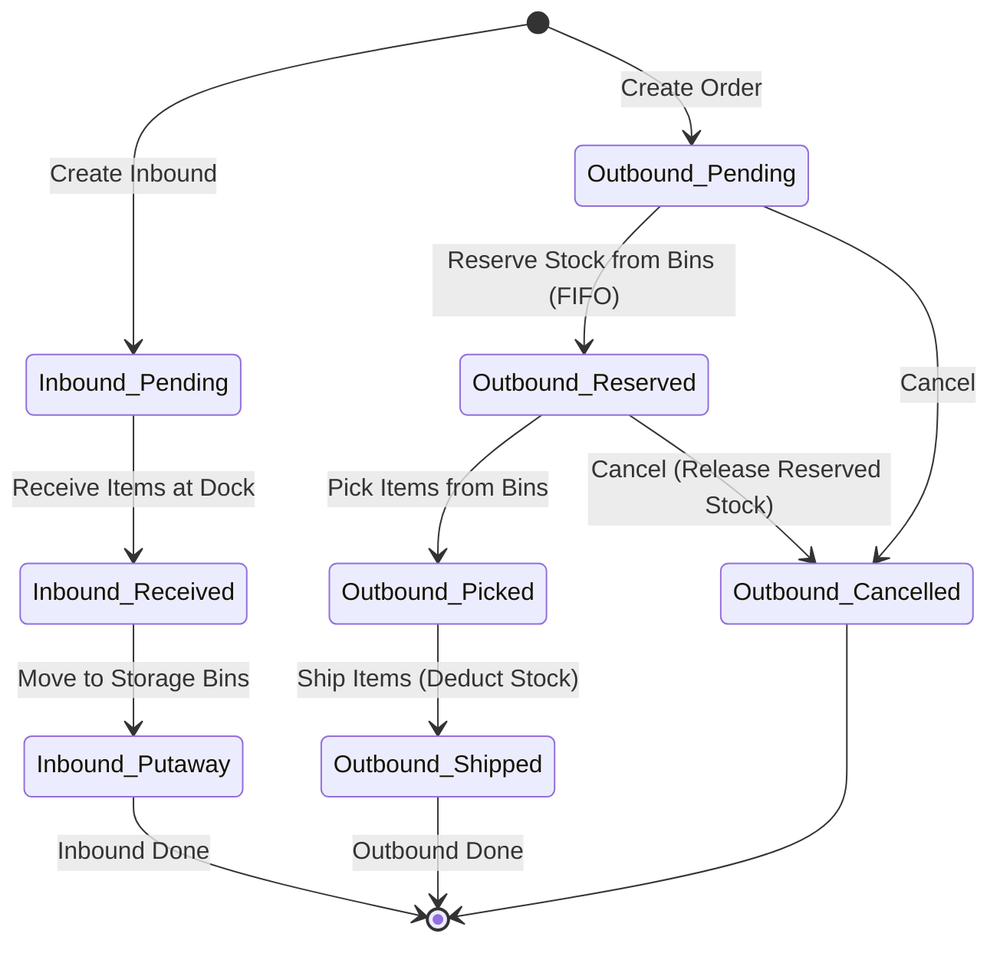

# LogiWMS: Real-Time Warehouse Inventory & Logistics Management System

LogiWMS is a production-level, portfolio-grade warehouse logistics and real-time inventory management platform built using the MEAN stack (MongoDB, Express, Angular, Node.js). 

It features modular architectures, transactional integrity, directed putaway slotting algorithms, FIFO allocation strategies, cryptographically chained audit trails, and instant WebSocket synchronization.

---

## 1. System Architecture



### Stock Movement State Machine



---

## 2. Key Technical Implementations

### Concurrency & ACID Integrity
Inventory operations (especially order reservations) are highly prone to race conditions (e.g., multiple pickers reserving the same item). We guarantee data integrity with:
1. **Mongoose Transactions**: Multi-document operations (adjusting stock and creating movements) are wrapped in MongoDB ACID session transactions.
2. **Atomic Conditionals**: Stock reservations use conditional updates:
   ```typescript
   Stock.findOneAndUpdate(
     { skuId, binId, quantityAvailable: { $gte: neededQty } },
     { $inc: { quantityReserved: neededQty, quantityAvailable: -neededQty } }
   )
   ```
   This guarantees reservation requests fail gracefully if stock falls below the threshold between the read and write steps.

### FIFO/LIFO Allocation Strategies
When an order is reserved, the Outbound Service retrieves bins containing the SKU sorted by their creation timestamp (`createdAt` ASC). Older stock is allocated first, minimizing write-offs.

### Directed Putaway Slotting
Instead of manual assignment, the putaway wizard queries the warehouse layout, matches the SKU's category against Zone restrictions, verifies weight/volume capacity limits, and ranks bins by remaining space and affinity.

### Cryptographically Chained Audit Trail
For SOC2 compliance, each `StockMovement` generates a SHA-256 hash containing:
`SHA256(previousHash | skuId | sourceBinId | destinationBinId | quantity | preQuantity | postQuantity | type | performedBy | timestamp)`
This forms a cryptographically verifiable history chain of inventory changes, preventing manual database adjustments.

---

## 3. Local Setup & Execution

The easiest way to run the entire stack (including the MongoDB replica set and Redis server) is via Docker Compose.

### Prerequisites
- Docker & Docker Compose
- Node.js v20+ (for local testing/compilation)

### Steps

#### Method A: Multi-Container Docker Stack (Recommended)
1. **Clone the repository**:
   ```bash
   git clone <repository_url>
   cd "expense and budget analytics platform"
   ```
2. **Launch the environment**:
   ```bash
   docker-compose up --build
   ```
   *This builds the Angular client, Express server, spins up Redis, launches MongoDB, and initiates the replica set (`rs0`) automatically.*
3. **Access the portal**:
   - Frontend App: [http://localhost:8080](http://localhost:8080)
   - Backend Server: [http://localhost:3000](http://localhost:3000)

#### Method B: Local Development
1. **Initialize Backend**:
   ```bash
   cd backend
   npm install
   npm run dev
   ```
2. **Initialize Frontend**:
   ```bash
   cd ../frontend
   npm install
   npm run start
   ```

---

## 4. API Endpoints Layout (`/api/v1/`)

- `POST /api/v1/auth/register` - Create user (Admin, Manager, Picker, Auditor).
- `POST /api/v1/auth/login` - Obtain access JWT + rotating refresh token.
- `POST /api/v1/auth/refresh` - Rotate access/refresh tokens.
- `GET /api/v1/inventory` - Get paginated inventory stock levels with filters.
- `GET /api/v1/inventory/audit-logs` - View cryptographically chained movement audit trail.
- `GET /api/v1/inventory/putaway-suggestions` - Fetch slot suggestions (Directed Putaway).
- `POST /api/v1/inventory/adjust` - Adjust stock manually (Admin only).
- `POST /api/v1/inbound/:id/receive` - Receive supplier shipments at dock.
- `POST /api/v1/inbound/:id/putaway` - Move items from dock to storage bins.
- `POST /api/v1/outbound/:id/reserve` - Allocate stock to orders (FIFO).
- `POST /api/v1/outbound/:id/pick` - picker marks order items as picked.
- `POST /api/v1/outbound/:id/ship` - Dispatch order, physically deducting stock.
- `GET /api/v1/reports/kpis` - Dashboard KPI charts.

---

## 5. Architectural Trade-offs

1. **Document-Level Mongoose Transactions vs. Optimistic Concurrency Control (OCC)**: Mongoose sessions require a MongoDB replica set. While OCC (using version properties) works on standalone databases, MongoDB replica set transactions were chosen because they provide standard ACID isolation across multiple documents, which is essential when coordinate-shifting inventory between different bins.
2. **Manual Dependency Injection vs. DI Containers**: We opted for constructor-based dependency injection manually passing instances. This avoids heavy third-party IoC reflection libraries, keeps the bundle lightweight, and provides excellent testability with clean Jest spies and mock overrides.

---

## 6. Scaling to Warehouse Scale (10M SKU Movements/Day)

In a massive enterprise warehouse environment processing 10 million SKU movements daily, the basic Express + Mongoose transaction pipeline would hit severe locking bottlenecks. We would scale the system with the following architecture:

### A. Stream Ingestion & Buffering (Apache Kafka)
Direct writes to MongoDB during peak intake hours would cause write-throttling. We would introduce **Apache Kafka** to ingest all incoming stock logs (`RECEIVED`, `PUTAWAY`, `SHIPPED`). Events are written instantly to Kafka partitions and processed asynchronously by consumer groups, flattening write spikes.

### B. Distributed Locking (Redis Redlock)
Using Mongoose session locks on hot SKU tables during high-volume picker allocations creates locking contention. We would manage item allocations using a distributed lock manager like **Redis Redlock** to acquire short-lived locks at the SKU-bin level:
- Pickers lock a specific SKU and Bin in Redis (takes `< 1ms`), perform the subtraction, and release.
- Lock bounds are highly granular, allowing thousands of pickers to work concurrently without waiting for slow database-level transactions.

### C. Write-Behind Cache (Redis Atomic Decr)
We would store available inventory quantities in Redis Hashes. During reservations, we execute atomic decrements (`DECRBY`) in Redis. If the return value is `< 0`, we reject immediately (O(1) stockout protection). A background worker drains reservation logs from Redis and updates MongoDB in batches (bulk writes), transforming millions of single updates into structured bulk operations.

### D. Cold-Data Sharding & Analytical Offloading (ClickHouse)
- MongoDB should only store active inventory levels and unresolved orders.
- Completed audit records (`StockMovement`) are offloaded via Kafka Connect to a column-oriented analytical database (e.g., **ClickHouse** or **Snowflake**). ClickHouse executes turnover and KPI queries across 100M+ rows in milliseconds, keeping the core transactional database extremely lightweight.
